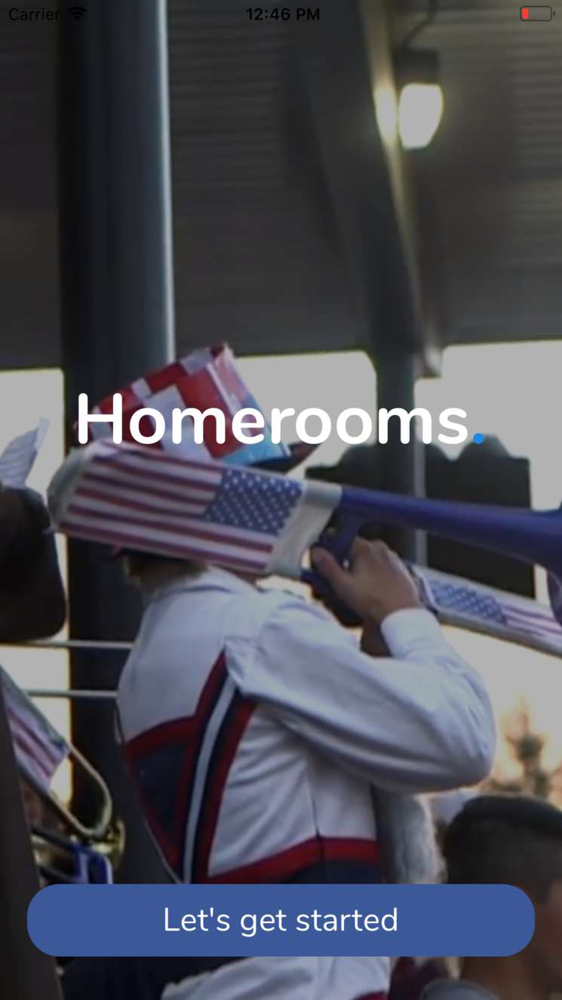
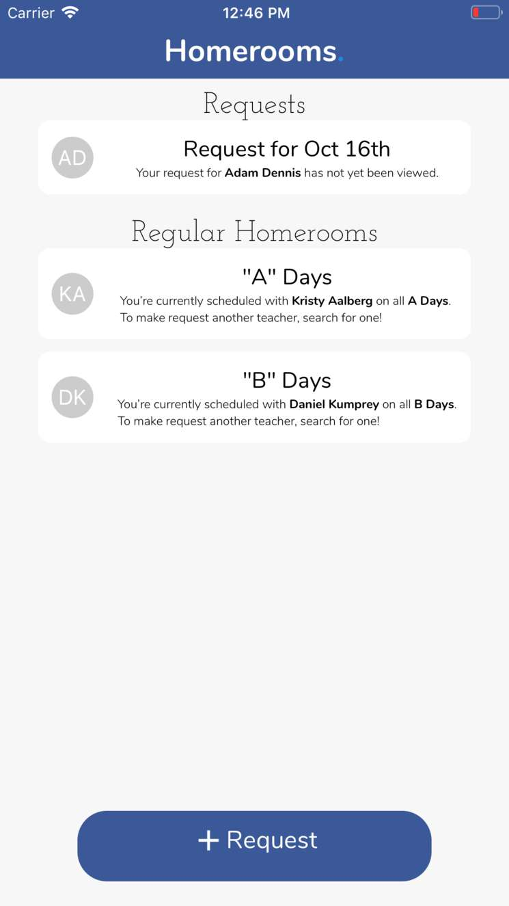
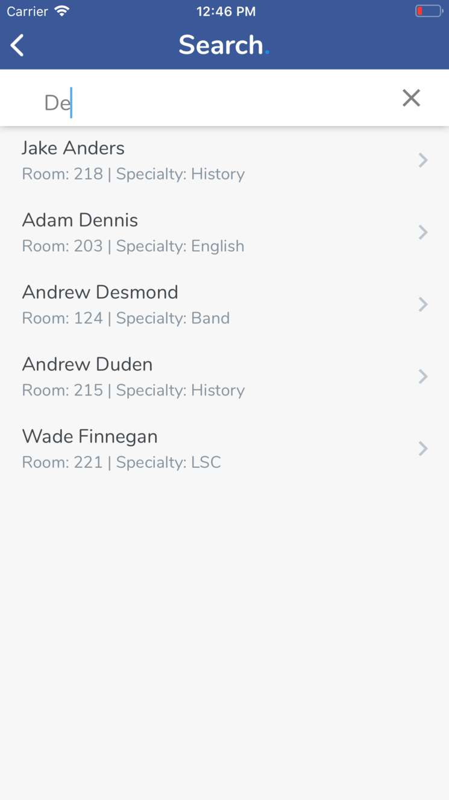
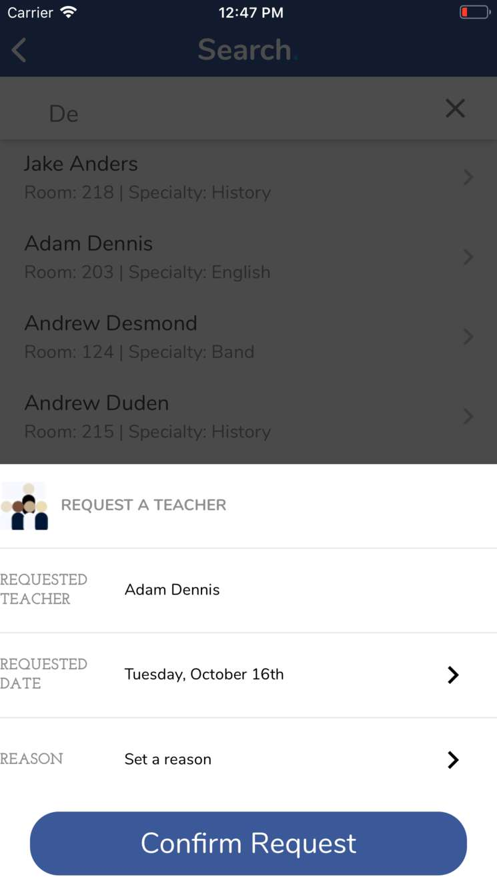

# Homerooms
:school: An app to connect teachers and learners.

*Created by Nick DeGroot during his Junior year (2017-2018).*

While school administrators have canceled the project, I've gone back and wrapped up just about everything planned. Below are screenshots from iOS. Feel free to download the APK or IPA from the Releases tab, or from the app store.

